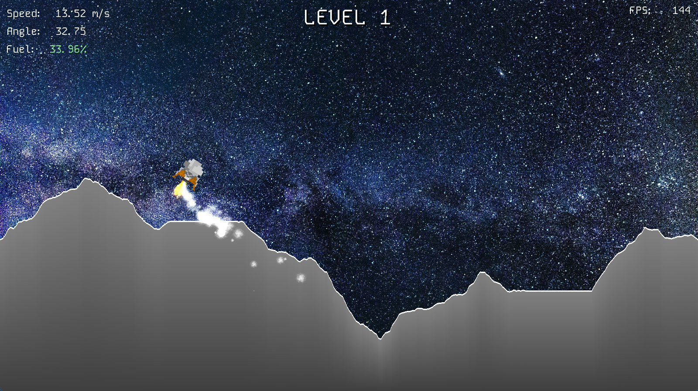
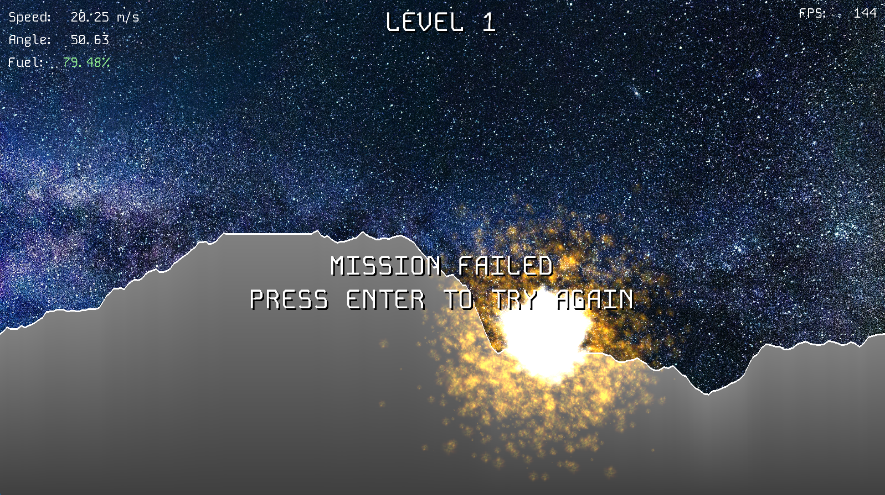

# Lunar Lander
*Project for CS5410 - Game Development*

## Gameplay

Find one of the flat landing areas and safely touch down!

The lander is only safe if *both* of these conditions are met:
- Speed lower than 5 m/s
- Angle between 0 and 5 degrees

Otherwise...

